# Roteiro para realização do projeto do 2º bimestre das disciplinas de ``Projeto e Infraestrutura de Redes`` e ``Serviços de Redes``

Objetivo: criação de *8* máquinas virtuais e criação de uma conexão entre quatro computadores com duas VMs cada.

# Sumário 

 * <a href="#vm-creating">Criando máquina virtual</a>
 * <a href="#vm-installing">Instalando pré-requisitos</a>
 * <a href="#vm-definitions">Definições</a>
 * <a href="#vm-finalpasses">Passos finais</a>
 * <a href="#vm-errors">Erros</a>
 * <a href="#vm-conclusion">Considerações finais e resultados</a>

    
## Diagrama de ordem do projeto

   ```mermaid
     graph LR;
         A(Instalar pacotes)-->B;
         B(Criar duas máquinas virtuais em <br> cada um dos quatro computadores)-->C;
         C(Definir configurações desejadas)-->D;
         D(Conectar via cabo de rede computadores);
   ```
    
        
<h2> Criando uma Máquina Virtual </h2>


  1. <section id="vm-creating"> criando uma VM utilizando um arquivo .OVA </section>
  
  >**_NOTA-01:_**
  Inicialmente, serão criadas duas máquinas virtuais em cada PC do grupo.
  >
  
  >**_NOTA-02:_**
   Todo esse processo deve ser feito em ``TODO`` computador, onde serão criadas duas máquinas virtuais em ``CADA`` um deles.
   >
  
  >**_NOTA-03:_**
  O arquivo .OVA é utilizado para criar uma máquina virtual já pronta. Nesse caso ele foi disponibilizado pelo professor da disciplina. 
  >

  Figura 01: Importando o arquivo .OVA
  
  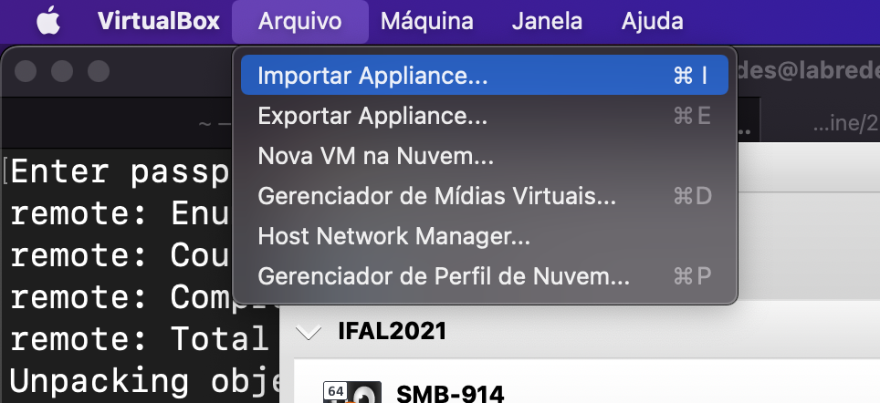
  
  <br>
  
  Figura 02: Especificações da Maquina Virtual .OVA
  
  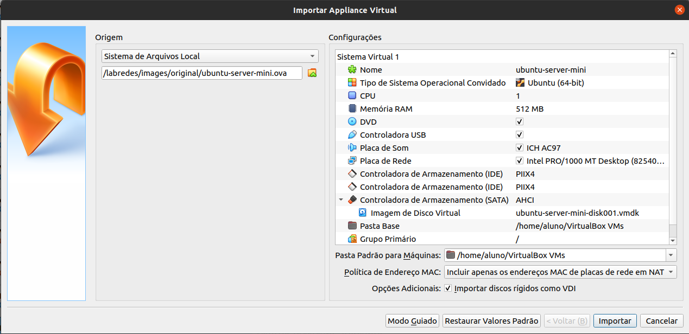
  
  2. Logando nas VMs

  Após tudo ter sido realizado, é necessário logar como administrador para prosseguir
  
   ### Para logar 
  
   ```
   ubunto login: administrador
   senha: adminifal
   ```
   
   Figura 05: Demonstração do resultado do comando
   
  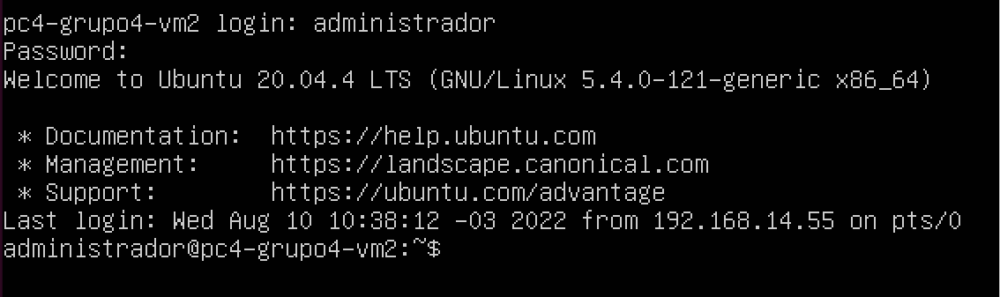
    
## Instalando pré requisitos
<section id="vm-installing"></section>

#### Certifique-se que a Máquina Virtual está conectada a internet <br>

 * Verifique se as configurações de rede de ``CADA`` VM está definida como ``NAT``
 * Modifique o arquivo .YAML e comente as linhas de IP estático(``adresses`` e ``gateway``)  
 * Verifique o nome do arquivo .YAML em sua VM
   
  Figura 08: Exemplo do nome do arquivo na máquina utilizada para exemplo
  
  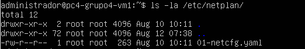
  
  Exemplo de como o arquivo deve ser modificado: 
  
  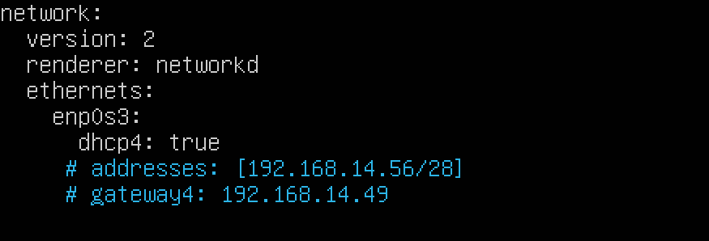
  
  ## Editando o .YAML
  
  ```
  sudo nano /etc/netplan/01-netcfg.yaml 
  ```
  
  >**_OBS:_**
  “YAML Ain’t Markup Language” é um formato de serialização de dados legível por humanos, sendo bastante utilizado para arquivos de configuração, assim     como o JSON e o XML.  
  >
  
  Após ter aberto o arquivo para edição, modifique as configurações antigas para as referente ao <b>PC</b> e a <b>VM</b>. Por exemplo, na figura à    seguir, foi utilizado o PC3-VM2
  
  >**_OBS:_**
  Essas modificações deverão ser feitas em <b>TODAS</b> as VMs
  >
  
  Figura 09: Exemplo do arquivo .YAML
  
  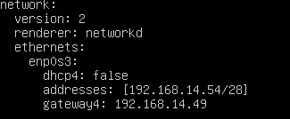

  * enps0s3: # nome da interface que está sendo configurada. Verifique com o comando 'ifconfig -a'
  * adresses: # IP e Máscara do Host.
  * gateaway: # IP do Gateway
  * dhcp4: false # dhcp4 false -> cliente DHCP está desabilitado, logo o utilizará o IP do campo 'addresses'    

    #### Após ter modificado o arquivo .YAML, as modificações terão que ser salvas com o seguinte comando: 

    ```
    sudo netplan apply
    ```        

 * O comando ``sudo apt update`` atualiza a lista de pacotes e programas que podem ser instalados na máquina.<br>
 ```
 sudo apt update
 ```
       
 * O comando ``sudo apt upgrade`` atualiza o sistema e baixa e instala atualizações de pacotes e dos programas da máquina.<br>
       
 ```
 sudo apt upgrade -y
 ```

 * Após tudo isso, prossiga a instalação dos pacotes: 

  #### Instalar o pacote de rede(para conseguir utilizar os comandos necessários, por exemplo, o ``ifconfig``)
  
  ```
  sudo apt install net-tools -y
  ```
  
  #### Visualizando as interfaces de rede
  ```
  ifconfig -a
  ```
  
  Figura 03: Mostrando as configurações de rede
  
  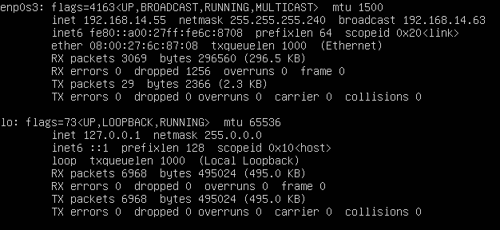
  
  2. Instalando o SSH Server <br>
  
  >**_NOTA-01:_**
  SSH é a sigla para Secure Socket Shell, sendo um dos protocolos específicos de segurança de troca de arquivos entre cliente e servidor de internet,       usando criptografia. 
  >
       
   * ### Instalando o SSH <br>
   ```
   sudo apt-get install openssh-server
   ```
      
   Figura 11: Instalando o SSH Server
      
   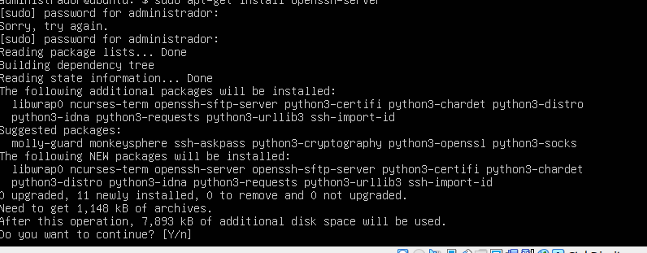
       
   * Digite ``y`` para prosseguir a instalação
   #### Após ter feito o processo inteiro, sem nenhum empecilho, prossiga:
       
   * Verifique se o ssh foi instalado corretamente: 

   ```
   systemctl status ssh
   ```

   * Verifique o status das portas do sistema:

   ```
   netstat -an | grep LISTEN. # verifique se a porta 22 está LISTENING
   ```
         
   Figura 12: Verificando se a porta 22 está sendo ouvida
         
   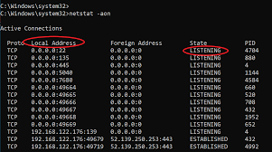

         
   * Para garantir o funcionamento do SSH Server, é necessário habilita-lo no firewall. Faça-o: 
   ```
   sudo ufw allow ssh
   ```
   
   * Ative o firewall: 
   ```
   sudo ufw enable
   ```
  
  <section id="vm-definitions"><h1>Definições</h1></section>
  
  Após ter concluído os passos anteriores, é necessário declarar um IP único na rede para todas as VMs de cada computador.
  
  * Para isso, foi feita uma tabela com todos os dados referentes a cada computador:
  
 <h2>Tabela 01</h2>
 
 <table>
  <tr>
    <th>Nome dos integrantes</th>
    <th>Nome dos PCs</th>
    <th>IP de rede</th>
    <th>IP de broadcast</th>
    <th>Intervalo de IPs</th>
  </tr>
  <tr>
    <td>Leonardo Ferreira</td>
    <td>PC1-GRUPO4</td>
    <td>192.168.14.48/28</td>
    <td>192.168.14.63</td>
    <td>192.168.14.[48-63]/28</td>
  </tr>
  <tr>
    <td>Julia Eloizi</td>
    <td>PC2-GRUPO4</td>
    <td></td>
    <td></td>
    <td></td>
  </tr>
  <tr>
    <td>Emanuel Vilela</td>
    <td>PC3-GRUPO4</td>
    <td></td>
    <td></td>
    <td></td>
  </tr>
  <tr>
    <td>Micaele Rayanne</td>
    <td>PC4-GRUPO4</td>
    <td></td>
    <td></td>
    <td></td>
  </tr>
</table>

>**_NOTA:_**
Todos os quatro PCs terão um IP estático identico
>

 <h2>Tabela 02</h2>


  <table>
    <tr>
      <th>Nome das VMs</th>
      <th>IP da VM</th>
      <th>hostname</th>
      <th>FQDN da VM</th>
      <th>Aliase da VM</th>
    </tr>
    <tr>
      <td>PC1-GRUPO4-VM01</td>
      <td>192.168.14.49</td>
      <td>PC1-GRUPO4-VM01</td>
      <td>leonardo-vm01.grupo4-914.ifalara.net</td>
      <td>burro1</td>
    </tr>
    <tr>
      <td>PC1-GRUPO4-VM02</td>
      <td>192.168.14.50</td>
      <td>PC1-GRUPO4-VM02</td>
      <td>leonardo-vm02.grupo4-914.ifalara.net</td>
      <td>burro2</td>
    </tr>
    <tr>
      <td>PC2-GRUPO4-VM03</td>
      <td>192.168.14.51</td>
      <td>PC2-GRUPO4-VM01</td>
      <td>julia-vm03.grupo4-914.ifalara.net</td>
      <td>ratocego1</td>
    </tr>
    <tr>
      <td>PC2-GRUPO4-VM04</td>
      <td>192.168.14.52</td>
      <td>PC2-GRUPO4-VM02</td>
      <td>julia-vm04.grupo4-914.ifalara.net</td>
      <td>ratocego2</td>
    </tr>
    <tr>
      <td>PC3-GRUPO4-VM05</td>
      <td>192.168.14.53</td>
      <td>PC3-GRUPO4-VM01</td>
      <td>emanuel-vm05.grupo4-914.ifalara.net</td>
      <td>farquaad1</td>
    </tr>
    <tr>
      <td>PC3-GRUPO4-VM06</td>
      <td>192.168.14.54</td>
      <td>PC3-GRUPO4-VM02</td>
      <td>emanuel-vm06.grupo4-914.ifalara.net</td>
      <td>farquaad2</td>
    </tr>
    <tr>
      <td>PC4-GRUPO4-VM07</td>
      <td>192.168.14.55</td>
      <td>PC4-GRUPO4-VM01</td>
      <td>micaele-vm07.grupo4-914.ifalara.net</td>
      <td>dorisfeia1</td>
    </tr>
    <tr>
      <td>PC4-GRUPO4-VM08</td>
      <td>192.168.14.56</td>
      <td>PC4-GRUPO4-VM02</td>
      <td>micaele-vm08.grupo4-914.ifalara.net</td>
      <td>dorisfeia2</td>
    </tr>
  </table>
  
  ### Definindo usuários
  
  Figura 06: Definindo o nome dos usuários
  
  
  
  ### Definindo os nomes das redes
  
  Figura 07: Definindo os nomes das redes referente à cada usuário
  
  
  
  ## Inserindo um nome para a rede ``hostname``

  ```
  sudo hostnamectl set-hostname nome-do-hostname
  ```
   
   ## Após ter concluído o processo, volte para as configurações anteriores:
   * Coloque a configuração de rede da VM como ``Modo Bridge``
       
   Figura 13: Colocando a rede em ``Modo Bridge``
       
   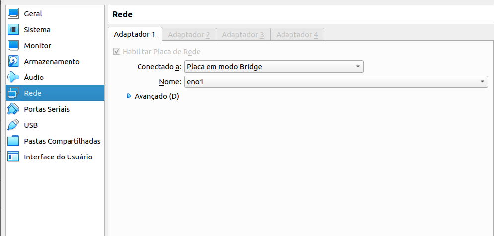
       
   * Tire os comentários do arquivo .YAML
       
   Figura 14: Voltando com as configurações anteriores do .YAML
       
   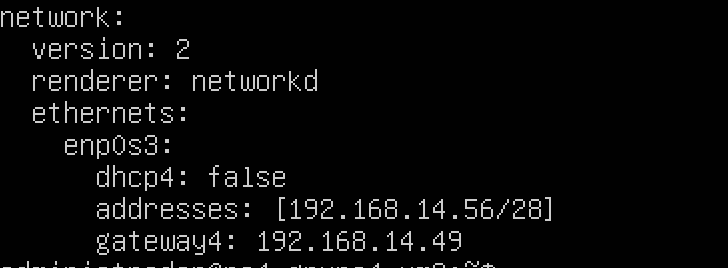


   >**_OBS:_**
   Lembre-se de dar o comando ``sudo netplan apply`` para salvar as alterações feitas
   >

   ## Agora a parte física:
      
   * Conecte todos os computadores utilizando ``cabos de rede`` e um ``switch``
   <br>

   Figura 15            |  Figura 16
   :-------------------------:|:-------------------------:
   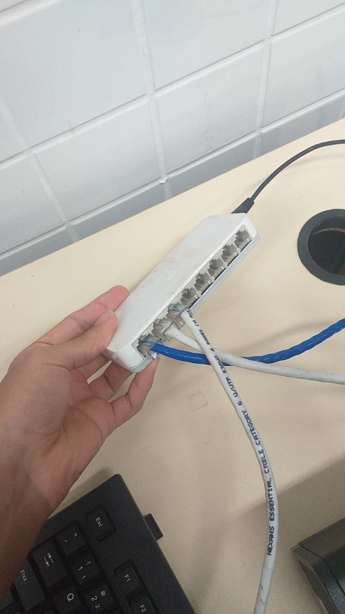 |  
   Conectando o  ``cabo de rede`` à entrada da <br> ``placa de rede`` do computador | Conectando a outra ponta do cabo de rede ao ``switch``

   # <section id="vm-finalpasses">Ultimos passos: </section>
   * Logar em outra máquina virtual(pode ser até em outro PC caso os dois ou mais estejam conectados via cabeamento):
       
   Exemplo: ``ssh usuario@ipderedeunico``
       
   Exemplo: 
   ```
   ssh administrador@192.168.14.53
   ```
       
   Após isso, está pronto o funcionamento do servidor. 
       
   ### <section id="vm-errors"><h1>Prováveis erros</h1></section>
       
   ### Ssh não instalado: 
     
   Figura 16: Erro no ssh
       
   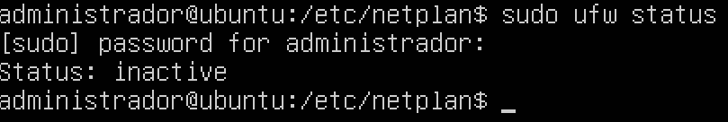

   ### Firewall não está ativo:
       
   Figura 17: Erro no firewall
     
   
     
   * Para ativa-lo, basta dar o comando ``sudo ufw enable``
       
     ### Firewall não está permitindo o ``ssh``(verificar a porta 22)
     
  <section id="vm-conclusion"><h1>Considerações finais e resultados</h1></section>
   
   ```mermaid
    pie
        title Desempenho de cada PC
        "PC01 - host-only" : 200
        "PC02" : 135
        "PC03" : 120
        "PC04" : 105
   ``` 
   
   # Ping do PC4-VM01
   
   para os outros
